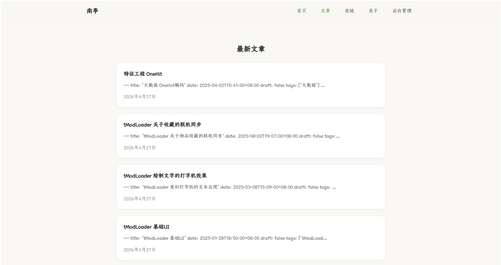
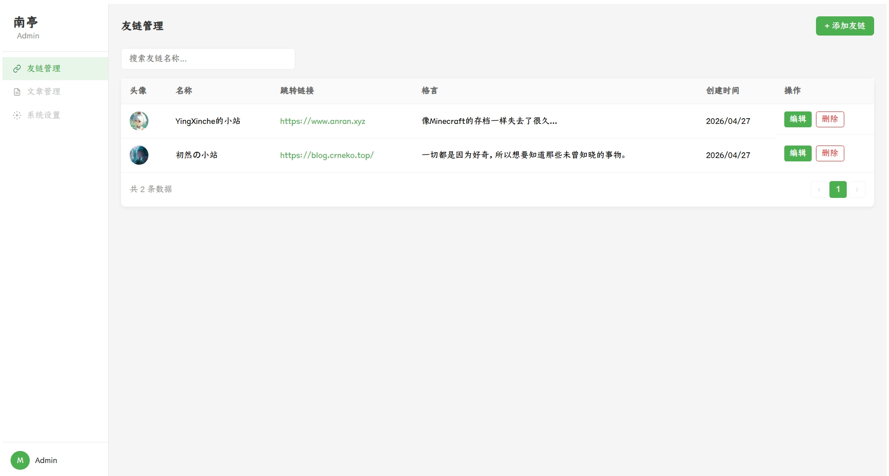

# 部署

> 在后端首次启动后，在执行文件根目录下会生成`configs/global.conf`文件，此文件可以更改暴露的端口以及pgsql链接字符串。
>
> 将文章直接上传至 `posts`目录下，在后端开启的情况下，文章会自动同步到数据库。此目录在可执行文件同级目录下。
>
> 无法对0.0.0.0暴露。需要配置nginx进行转发。

## 安装pgsql

```sh
https://www.postgresql.org/download/
```


## 设置pgsql密码

```sh
sudo -u postgres psql
```

```postgresql
ALTER USER postgres WITH PASSWORD '123456';
```


## 查看pgsql端口

> 默认一般是5432

```sh
netstat -tulpn | grep postgres
```


## 执行迁移脚本

```sh
sudo -u postgres psql
create database blog;
\q;
sudo -u postgres psql -U postgres -h 127.0.0.1 -d blog -f NanTingBlog.API.Services.Db.BlogContext.sql
```


## 编辑Nginx转发

### 后端

```nginx
server {
    listen 25001 ssl;
    server_name yourdns.temp;
    ssl_certificate      /usr/local/nginx/ssl/yourdns.temp.pem;
    ssl_certificate_key  /usr/local/nginx/ssl/yourdns.temp.key;
    ssl_session_cache    shared:SSL:1m;
    ssl_session_timeout  5m;

    ssl_ciphers  HIGH:!aNULL:!MD5;
    ssl_prefer_server_ciphers  on;

    location / {
        proxy_pass http://127.0.0.1:6999/; # 这个看你自己端口
    }
}
```


### 前端

```nginx
server {
   listen       443 ssl;
   server_name  yourdns.temp;

   ssl_certificate      /usr/local/nginx/ssl/yourdns.temp.pem;
   ssl_certificate_key  /usr/local/nginx/ssl/yourdns.temp.key;

   ssl_session_cache    shared:SSL:1m;
   ssl_session_timeout  5m;

   ssl_ciphers  HIGH:!aNULL:!MD5;
   ssl_prefer_server_ciphers  on;

   location / {
    proxy_pass http://127.0.0.1:1313; # http-server -p 1313
   }
}
```


## 启动脚本

```sh
nohup http-server /opt/nantingBlog/fornt -p 1313 >> fornt.log &
nohup /opt/nantingBlog/end/NanTingBlog.API >> end.log &
```

# 效果




